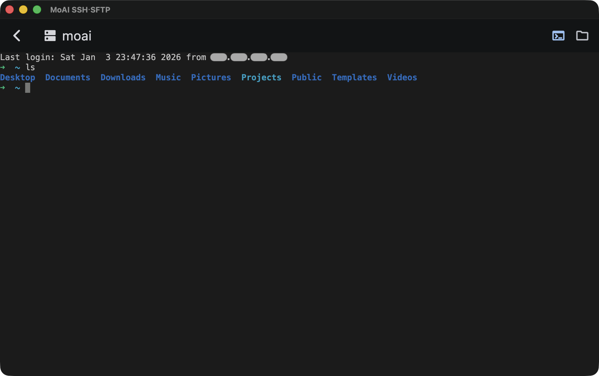
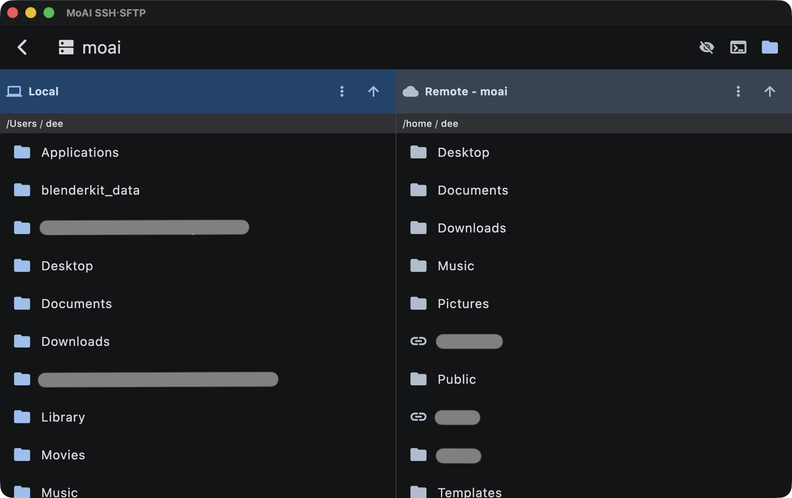
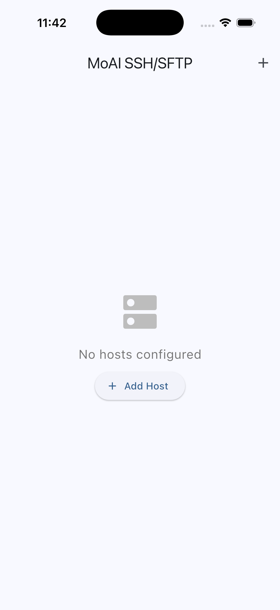
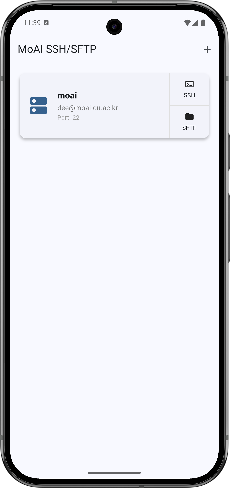
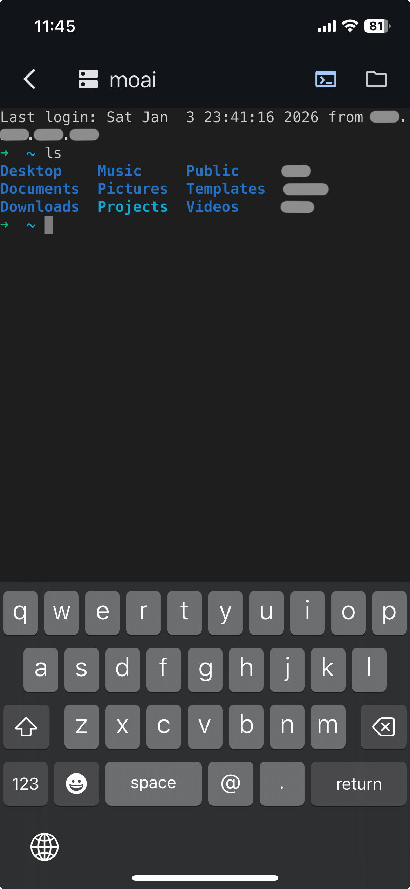
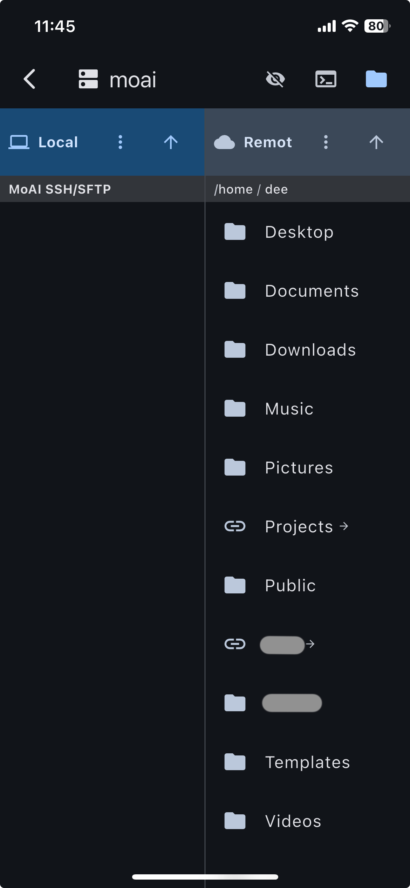

#   MoAI SSH・SFTP

한국어 | [English](../README.md)

크로스 플랫폼을 지원하는 SSH 및 SFTP 클라이언트

## 개요

- 여러 플랫폼에서 원활한 SSH 터미널 접속과 SFTP 파일 관리를 제공하는 다목적 애플리케이션
- 직관적인 인터페이스와 강력한 기능을 통해 개발자와 시스템 관리자의 원격 서버 관리를 간편하게 만들어 줄 수 있음

### Screenshot - Desktop
<div align="left">
  
  
</div>

### Screenshot - Mobile
<div align="left">
  
  
  
  
<div>

## 주요 기능

### 호스트 관리
- **종합적인 호스트 설정**: 호스트명, 포트, 사용자명, 인증 방법(비밀번호/키 파일)을 포함한 SSH 연결 정보 저장 및 관리
- **CRUD 작업**: 호스트 구성을 쉽게 생성, 읽기, 업데이트, 삭제
- **운영체제 인식**: 자동 OS 유형 감지 및 아이콘 표시 (Linux, Windows, macOS, Unix)
- **빠른 접근**: 모든 구성된 호스트를 그리드/리스트 뷰로 표시하며, 단일 클릭으로 상세 정보 확인, 더블 클릭으로 연결

### 사용자 인터페이스
- **반응형 디자인**:
  - 모바일: 카드 오른쪽에 세로로 배치된 액션 버튼
  - 데스크탑: 카드 아래쪽에 가로로 배치된 액션 버튼
- **다크/라이트 테마**: 시스템 설정을 따르는 자동 테마 지원
- **다국어 지원**: 영어 및 한국어 내장 지원. 기타 언어 추가 가능

## 지원 플랫폼

- ✅ **macOS**
- ✅ **Windows**
- ✅ **Linux**
- ✅ **iOS**
- ✅ **Android**

## 사전 요구사항

프로젝트를 빌드하기 전에 다음이 설치되어 있는지 확인하세요:

- **Flutter SDK**: 버전 3.10.4 이상
  ```bash
  flutter --version
  ```
- **Dart SDK**: 버전 3.10.4 이상 (Flutter에 포함됨)
- **플랫폼별 요구사항**:
  - **macOS**: Xcode
  - **Windows**: C++ 데스크탑 개발 도구가 포함된 Visual Studio 2022
  - **Linux**: 표준 개발 도구 (`build-essential`, `libgtk-3-dev` 등)
  - **iOS**: Xcode, CocoaPods
  - **Android**: Android Studio, Android SDK

## 설치 방법

### 1. 저장소 복제

```bash
git clone git@github.com:juliendkim/MoAI-SSH-SFTP.git
cd MoAI-SSH-SFTP
```

### 2. 의존성 설치

```bash
flutter pub get
```

### 3. 다국어 파일 생성

```bash
flutter gen-l10n
```

## 빌드 방법

### macOS

```bash
flutter build macos --release
```

앱 위치: `build/macos/Build/Products/Release/MoAI SSH・SFTP.app`

### Windows

```bash
flutter build windows --release
```

앱 위치: `build/windows/x64/runner/Release/`

### Linux

```bash
flutter build linux --release
```

앱 위치: `build/linux/x64/release/bundle/`

### iOS

```bash
flutter build ios --release
```

Xcode 프로젝트를 열어 서명:
```bash
open ios/Runner.xcworkspace
```

### Android

```bash
flutter build apk --release
```

APK 위치: `build/app/outputs/flutter-apk/app-release.apk`

앱 번들 (Play Store 권장):
```bash
flutter build appbundle --release
```

## 개발 모드에서 실행

### 데스크탑에서 실행 (macOS/Windows/Linux)

```bash
flutter run -d macos    # macOS
flutter run -d windows  # Windows
flutter run -d linux    # Linux
```

### 모바일에서 실행

```bash
flutter devices              # 사용 가능한 장치 목록 확인
flutter run -d <device-id>   # 특정 장치에서 실행
```

## 사용법

### 호스트 추가

1. 홈 화면에서 **+** 버튼 클릭
2. 호스트 구성 정보 입력:
   - **이름**: 호스트의 친근한 이름
   - **OS 타입**: 운영체제 선택
   - **호스트명**: IP 주소 또는 도메인 이름
   - **포트**: SSH 포트 (기본값: 22)
   - **사용자명**: SSH 사용자명
   - **인증**: 비밀번호 또는 키 파일 선택
3. **저장**

### SSH로 연결

- 빠른 SSH 연결을 위해 호스트 카드를 **더블 클릭**
- 또는 호스트 카드의 **SSH** 버튼 클릭
- 활성 SSH 세션이 있는 새 터미널 탭이 열립니다

### SFTP로 연결

- 호스트 카드의 **SFTP** 버튼 클릭
- 듀얼 페인 파일 브라우저가 있는 SFTP 탐색기가 열립니다
- 디렉토리를 탐색하고 로컬과 원격 시스템 간에 파일을 전송합니다

## 프로젝트 구조

```
lib/
├── l10n/                          # 다국어 파일
│   ├── app_en.arb                # 영어 번역
│   ├── app_ko.arb                # 한국어 번역
│   └── generated/                # 자동 생성된 다국어 코드
├── models/                        # 데이터 모델
│   └── host.dart                 # 호스트 구성 모델
├── providers/                     # 상태 관리
│   └── host_provider.dart        # 호스트 데이터 프로바이더
├── screens/                       # UI 화면
│   ├── home_screen.dart          # 메인 호스트 리스트 화면
│   ├── connection_screen.dart    # SSH/SFTP 탭 컨테이너
│   ├── ssh_terminal_screen.dart  # SSH 터미널 UI
│   └── sftp_explorer_screen.dart # SFTP 파일 브라우저 UI
├── services/                      # 비즈니스 로직
│   ├── host_storage_service.dart # 호스트 로컬 저장소
│   ├── ssh_service.dart          # SSH 연결 처리
│   └── sftp_service.dart         # SFTP 작업
├── widgets/                       # 재사용 가능한 위젯
│   ├── host_card.dart            # 호스트 표시 카드
│   └── host_form.dart            # 호스트 구성 폼
└── main.dart                      # 애플리케이션 진입점
```

## 주요 의존성

- **dartssh2** (^2.13.0): SSH 및 SFTP 프로토콜 구현
- **xterm** (^4.0.0): 터미널 에뮬레이터 위젯
- **provider** (^6.1.2): 상태 관리 솔루션
- **shared_preferences** (^2.3.3): 로컬 데이터 저장
- **path_provider** (^2.1.4): 플랫폼별 디렉토리 경로
- **file_picker** (^8.1.6): 파일 선택 대화상자
- **flutter_slidable** (^3.1.1): 스와이프 액션 제스처

## 문제 해결

### 빌드 실패

- **빌드 캐시 정리**:
  ```bash
  flutter clean
  flutter pub get
  ```

- **Flutter 업데이트**:
  ```bash
  flutter upgrade
  ```

---

**버전**: 1.0.0+1
**빌드 환경**: Flutter 3.10.4+
**최종 업데이트**: 2026년 1월

## 라이선스

MIT License - 자세한 내용은 [LICENSE](LICENSE) 파일을 참조하세요
